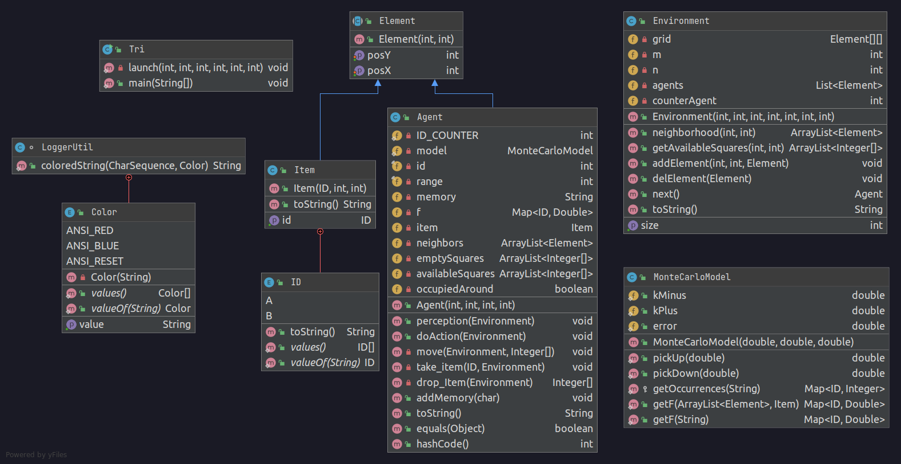

# TP SMA :
# Exemple de tri collectif multi-agents

## Documentation du code
### Diagramme de classes


#### Classe Tri :
La classe Tri est la classe principale contenant la fonction `main(String[] args)`.
Elle utilise la méthode statique `launch(int m, int nbA, int nbB, int nbAgents, int range, int memorySize)` 
qui initialise environnement et sur un nombre d'épisodes donnés, à chaque itération un agent perçois son environnement 
et agit dans celui-ci (voir ci-dessous).   
```java
while (counter < limit) {
agent = env.next();
agent.perception(env);
agent.doAction(env);
counter++;
```
#### Classe MonteCarloModel
C'est une classe qui permet de calculer les probabilités de prise ou de dépot d'objets par les agents.
On utilise cette classe de manière statique, il n'est pas utile d'affecter une instance à un objet 
puisqu' elle possède seulement des attributs et des méthodes statiques.  

On assigne les paramètres k+, k- et l'erreur pour la variante (erreur = 0 sinon) :  `new MonteCarloModel(k+, k-, erreur);`

#### Classe Environment
Cette classe représente l'environnement, elle contient une grille constituée des éléments (agents ou objets) qui sont 
répartis aléatoirement sur la grille.
Elle sert à mettre à jour l'environnement et l'agent qui doit agir.

#### Classe Element
C'est une classe abstraite qui définit les éléménents par leur position.

#### Classe Item
La classe `Item` hérite de la classe `Element` et définit les objets qui peuvent être de type
<span style=color:red>A</span> ou <span style=color:blue>B</span>.

#### Classe Agent
La classe `Agent` hérite de la classe `Element` et désigne les agents avec un id qui s'incrémente à chaque nouvelle
instance de la classe. Les méthodes principales sont `perception(Environment environment)` et 
`doAction(Environment environment)`.

## Réalisation
### Question 1
### Question 2


