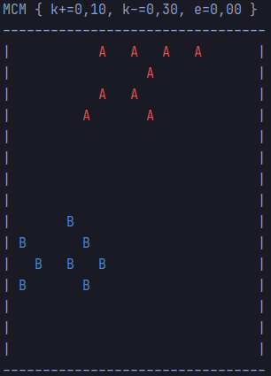

# TP SMA :
# Exemple de tri collectif multi-agents

## Documentation du code
### Diagramme de classes


#### Classe Tri :
La classe Tri est la classe principale contenant la fonction `main(String[] args)`.
Elle utilise la méthode statique `launch(int m, int nbA, int nbB, int nbAgents, int range, int memorySize)` 
qui initialise environnement et sur un nombre d'épisodes donnés, à chaque itération un agent perçois son environnement 
et agit dans celui-ci (voir ci-dessous).   
```java
while (counter < limit) {
agent = env.next();
agent.perception(env);
agent.doAction(env);
counter++;
```
#### Classe MonteCarloModel
C'est une classe qui permet de calculer les probabilités de prise ou de dépôt d'objets par les agents.
On utilise cette classe de manière statique, il n'est pas utile d'affecter une instance à un objet 
puisqu' elle possède seulement des attributs et des méthodes statiques.  

On assigne les paramètres k+, k- et l'erreur pour la variante (erreur = 0 sinon) :  `new MonteCarloModel(k+, k-, erreur);`

#### Classe Environment
Cette classe représente l'environnement, elle contient une grille constituée des éléments (agents ou objets) qui sont 
répartis aléatoirement sur la grille.
Elle sert à mettre à jour l'environnement et l'agent qui doit agir.

#### Classe Element
C'est une classe abstraite qui définit les éléments par leur position.

#### Classe Item
La classe `Item` hérite de la classe `Element` et définit les objets qui peuvent être de type
<span style=color:red>A</span> ou <span style=color:blue>B</span>.

#### Classe Agent
La classe `Agent` hérite de la classe `Element` et désigne les agents avec un id qui s'incrémente à chaque nouvelle
instance de la classe. Les méthodes principales sont `perception(Environment environment)` et 
`doAction(Environment environment)`.

## Réalisation

### Question 1

```java
new MonteCarloModel(0.1, 0.3, 0.d);
launch(50, 50, 50, 20, 1, 10);
```

 *initialisation*
 *objets triés*

Les agents ont bien rassemblé les objets en groupes et globalement par leur type même si la séparation pourrait 
être plus distincte.


### Question 2

On utilise la variante qui consiste à introduire un pourcentage d’erreurs `e` dans la reconnaissance des objets 
(si `e=0` on revient à la version orginale). La proportion d'objets `f` pour chaque type d'objet va augmenter 
puisqu'on prend en compte pour chacun l'autre type réevaluer par l'erreur `e`. Par conséquent la probabilité 
de dépôt `putDown(double f)` va augmenter aux alentours des groupes mixtes et la probabilité de prise 
`pickUp(double f)` diminue avec la densité des objets en mémoire.  
On peut conjecturer que l'agent dégradera moins les groupes d'objets en différenciant moins les types d'objets.

#### Tests en faisant varier l'erreur :



#### Conclusion 
Les groupes sont plus espacé lorsque l'erreur est proche de `e = 0`. L'erreur ne doit pas être trop grande (`e > 0`) 
sinon elle ne permet plus de bien séparer les deux types d'objets 
<span style=color:red>A</span> et <span style=color:blue>B</span>.

Les groupes semblent aussi plus ressérrés quand l'erreur augmente par l'exemple avec 
`e = 0.8` est marquant par rapport à `e = 0.2`.

### Influence de la disposition initiale des éléments


Les résultats ci-dessus sont sensiblement similaires, la figure en bas à gauche montre qu'il peut y avoir des disparités 
selon les essais causées par l'introduction de l'aléatoire dans la décision de l'agent.


Les résultats sont un peu différents même si globalement ils se ressemblent, il est tout de même préférable de garder 
les même CI pour comparer les résultats.

### Influence de k+ et k-

Lorsque `k+` augmente la probabilité de prise `pickUp(double f)` augmente tandis que lorsque `k-` augmente 
la probabilité de dépôt `putDown(double f)` diminue.

#### Version intiale (`e=0`) k+


Quand `k+` est très grand les agents crées de plus petits groupes.


`k+` assez faible donne de bon résultat et force les agents à prendre seulement des objets plutôt isolés.

#### Variante (`e=0.2`) k+


En utilisant la variante, `f` augmente et donc il faut compenser avec `k+` qui peut être plus élevé afin que la 
probabilité de prise `pickUp(double f)`ne soit pas trop faible.

#### k-


`k-` doit être assez élevé en comparaison avec `k+` afin que la probabilité de dépot `putDown(double f)`
soit assez basse pour la poser seulement aux alentours de groupes d'objets.


En effet si `k-` est trop faible, le tri collectif va former plus de petits groupes.

#### Comparaison de k+ et k-

`k+` est plus sensible que `k-`, en effet les résultats change beacoup plus avec une variation de `k+`.
De plus l'erreur (ainsi que la taille mémoire) est à bien prendre en compte avec les paramètres `k+` et `k-`.

### La taille mémoire

La taille mémoire ne doit pas être trop grande sinon elle ne permet plus à l'agent de distinguer un objet isolé 
d'un groupe d'objets et l'agent a du mal à laisser des groupes (voir ci-dessous pour une mémoire de 20) et doit 
dépendre aussi du nombre d'objets.


